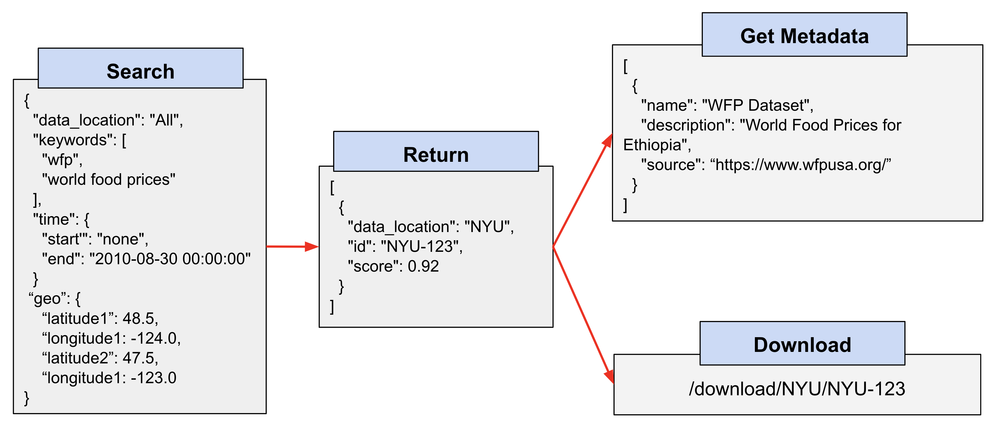

# World Modelers Federated Search

This repository contains the API specification for a federated search capability that enables:

1. Geospatial, temporal, and keyword based search across the [ISI](https://datamart-upload.readthedocs.io/en/latest/) and [NYU](https://auctus.vida-nyu.org/) D3M Datamarts
2. [Concept](https://github.com/worldmodelers/ontologies) based search using a UAZ concept mapping service
3. Metadata retrieval for various datasets and variables
4. Structured data download

The Open API Specification file for this API is contained in [`federated_search_api.yaml`](https://github.com/WorldModelers/federated-search/blob/master/federated_search_api.yaml). Below is an example of the API usage:

In the future, this repository will house server code that manages this API.